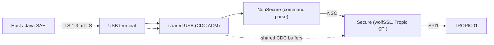

# SE_firmware

TrustZone firmware for **STM32U535** (TS13 DevKit) with a **TROPIC01** secure element.

- **Secure** — wolfSSL TLS 1.3 client, libtropic / SPI to TROPIC01, NSC API, MCU NV
- **NonSecure** — USB CDC ACM console; parses commands and forwards them via NSC. After arming, the same CDC pipe carries TLS bytes to Secure.

Boot path: Secure init → jump to NonSecure at `0x08030000` → USB enumerates as CDC ACM.



PIN for provisioned OTP never appears on USB. The console only arms a mode and a Unix time; PIN and payloads ride inside TLS after the handshake.

---

## Documentation

| Doc | Contents |
| --- | --- |
| [docs/HOW_TO_RUN.md](docs/HOW_TO_RUN.md) | First flash vs later sessions (silicon) |
| [docs/COMMANDS.md](docs/COMMANDS.md) | USB console syntax, parameters, two-step flows |
| [docs/COMMUNICATION.md](docs/COMMUNICATION.md) | USB/NSC pipe, TLS 1.3, LV uplink/downlink, OTP records |
| [docs/TROPIC.md](docs/TROPIC.md) | R-MEM slots, dual cursors, MCU NV, M&D, classical vs PQC |
| [docs/SECURITY.md](docs/SECURITY.md) | PQ attacker: surfaces, hardening, residuals |
| [docs/HARDWARE.md](docs/HARDWARE.md) | Flash/RAM map, option bytes, pins, GTZC |
| [host/README.md](host/README.md) | WSL2 TROPIC01 model tests and `se_host` |

---

## Layout

```text
Secure/                  Secure world (TLS, Tropic, NSC, MCU NV)
NonSecure/               USB CDC + host command parsing
Secure_nsclib/           NSC headers shared with NonSecure
libtropic/               Vendored TROPIC01 SDK (read-only)
host/                    Model tests + se_host — see host/README.md
docs/                    Firmware documentation (this index)
scripts/embed_fw_creds.py  Host helper (PEM→DER); not a firmware compile step
```
